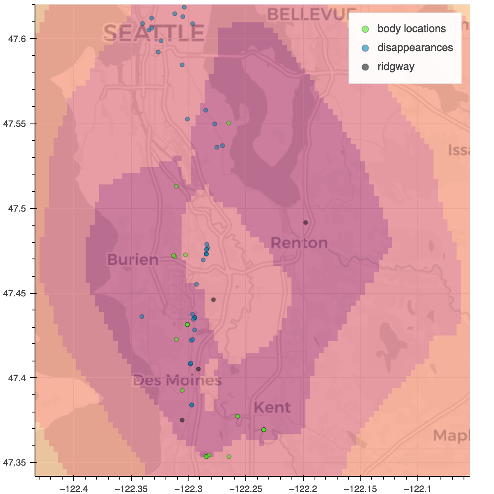

# Implementation & Results of Rossmo's Formula

## Map One

```{raw} html
:file: rossmo_et_ridgway/maps/map_one.html
```

_**Generated using both disappearance and body dumpsite locations for a total of 91 crime locations.**_

## Map Two


```{raw} html
:file: rossmo_et_ridgway/maps/map_two.html
```

_**Generated using body dumpsite locations for a total of 48 crimes locations**_

## Map Three
```{raw} html
:file: rossmo_et_ridgway/maps/map_three.html
```

_**Generated using disappearance locations for a total of 43 crimes locations**_

## Notes

**Map Two**, which uses only body dumpsite locations has three key Ridgway-related locations in its highest probability "zone" (A, C, and D listed below). This is worth noting -- we only have complete certitude of these locations; many disappearances are scant on details. 



- **A** - Kenworth Trucking Company -- Ridgway's place of work from 1969 to 2001
- **B** - Gary Ridgway's mother's residence
- **C** - Gary Ridgway's residence in SeaTac (from 1982 to 1989 - when the majority of Ridgway's murders took place)
- **D** - Gary Ridgway's residence in Des Moines (from 1989 to 1997)

The following arguments were used to create the above maps.

```
ACCURACY = 2000
BUFFER = 0.1 (miles)
F = 1
G = 1
```

An accuracy of `2000` gives a grid of 2000x2000 map points that are about 0.7 miles, or 3700 feet apart.