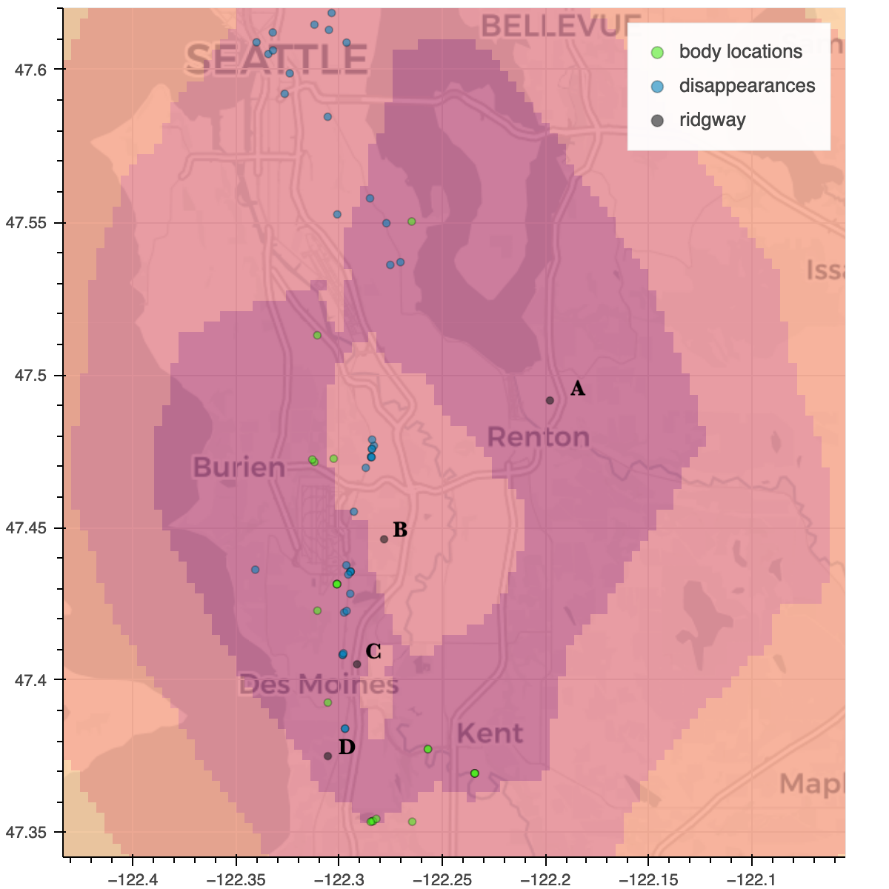

# Notes

**Map Two**, which uses only body dumpsite locations has three key Ridgway-related locations in its highest probability "zone" (A, C, and D listed below). This is worth noting -- we only have complete certitude of these locations; many disappearances are scant on details. 

- **A** - Kenworth Trucking Company -- Ridgway's place of work from 1969 to 2001
- **B** - Gary Ridgway's mother's residence
- **C** - Gary Ridgway's residence in SeaTac (from 1982 to 1989 - when the majority of Ridgway's murders took place)
- **D** - Gary Ridgway's residence in Des Moines (from 1989 to 1997)